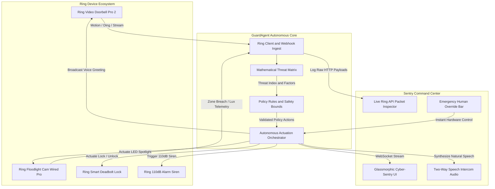

# 🛡️ GuardAgent AI
### Autonomous Intelligent Security & Access Control for the Ring Ecosystem
**Amazon Developer Hackathon: Build, Ship, Shape (2026)**  
**Track:** 🔔 **Ring Track** (Access Control, IoT Home Automation, Caretaking & Security)

[](LICENSE)
[](https://developer.amazon.com/docs/ring)
[](https://nodejs.org)
[](https://developer.mozilla.org/en-US/docs/Web/API/WebSockets_API)
[](https://github.com/Poovarasan-2005)
[](https://github.com/Poovarasan-2005/GUARDAGENT-AI-Autonomous-Intelligent-Sentry-for-the-Ring-Ecosystem)

> **Tagline:** Autonomous real-time threat detection, physical access control, and intelligent sentry operations for the Ring ecosystem.

---

## 📑 Table of Contents

- [1. Overview](#1-overview)
- [2. Problem Statement](#2-problem-statement)
- [3. Solution](#3-solution)
- [4. Key Features](#4-key-features)
- [5. System Architecture](#5-system-architecture)
- [6. Technology Stack](#6-technology-stack)
- [7. Threat Assessment & Reasoning Engine](#7-threat-assessment--reasoning-engine)
- [8. Real-Time Telemetry & Hardware Simulation](#8-real-time-telemetry--hardware-simulation)
- [9. Security Architecture, Safety Guardrails & Human Override](#9-security-architecture-safety-guardrails--human-override)
- [10. Ring Device Data Models & Telemetry Schema](#10-ring-device-data-models--telemetry-schema)
- [11. Ring REST API Documentation](#11-ring-rest-api-documentation)
- [12. Installation & Quick Start](#12-installation--quick-start)
- [13. Running Locally](#13-running-locally)
- [14. Production & Deployment Modes](#14-production--deployment-modes)
- [15. Automated Testing & Scenario Verification Suite](#15-automated-testing--scenario-verification-suite)
- [16. Benchmark Threat Scenarios & Mathematical Calibration](#16-benchmark-threat-scenarios--mathematical-calibration)
- [17. User Interface & Sentry Command Center](#17-user-interface--sentry-command-center)
- [18. Project Structure](#18-project-structure)
- [19. Limitations & Future Roadmap](#19-limitations--future-roadmap)
- [20. Disclaimer & License](#20-disclaimer--license)

---

## 1. Overview

**GuardAgent AI** is an enterprise-grade, autonomous physical security and intelligent access control sentry engineered specifically for the **Amazon Ring ecosystem**.

Traditional smart doorbells and floodlights act as passive observation devices—they broadcast alerts to a smartphone, leaving the homeowner to scramble through menus, interpret compressed thumbnails, and attempt to shout over low-quality microphones. In high-stakes situations—such as a porch package theft occurring in 10 seconds, an intruder testing door locks at 2:00 AM, or an elderly relative falling on the threshold—human reaction time is often too slow or completely unavailable.

**GuardAgent AI closes this gap by transforming passive Ring devices into an active, autonomous intelligent sentry.** It continuously ingests camera telemetry, executes multi-factor mathematical threat scoring, conducts natural two-way speech intercom negotiations, unlocks and relocks Ring smart deadbolts for verified couriers, and triggers graduated physical deterrence—all while keeping homeowners firmly in control with real-time visibility and instant manual overrides.

---

## 2. Problem Statement

Modern smart home perimeter defense suffers from four systemic failures:

1. **Alert Fatigue & Noise Overload**:
   Homeowners receive dozens of generic "Motion Detected" notifications daily caused by tree branches, passing cars, neighborhood cats, or shadows. Users inevitably mute notifications or become desensitized.
2. **Critical Reaction Latency**:
   Porch piracy takes an average of **12 seconds** from approach to departure. Residential burglaries take less than **90 seconds**. By the time a user unlocks their phone, launches an app, waits for a video stream to buffer, and deciphers the scene, the opportunity to deter or protect has passed.
3. **Passive Hardware Silos**:
   Cameras capture crimes after the fact rather than actively preventing them. Doorbells, floodlights, smart locks, and sirens operate in isolated functional silos rather than acting as a synchronized defensive perimeter.
4. **Frictional Access Control for Deliveries**:
   Over 1.7 million packages are stolen or misplaced daily across the United States. Without an automated, trusted physical handoff mechanism, delivery personnel must leave boxes exposed on front porches in plain view of street traffic and adverse weather.

---

## 3. Solution

GuardAgent AI resolves these failures through a **synchronized 7-step autonomous control loop** that governs every perimeter event in real time:

```
  ┌──────────┐     ┌─────────────┐     ┌──────────┐     ┌─────────┐
  │  DETECT  │ ──► │  UNDERSTAND │ ──► │  DECIDE  │ ──► │   ACT   │
  └──────────┘     └─────────────┘     └──────────┘     └─────────┘
       ▲                                                     │
       │                                                     ▼
┌──────────────┐   ┌─────────────┐                      ┌─────────┐
│HUMAN OVERRIDE│ ◄─│     LOG     │ ◄─────────────────── │ VERIFY  │
└──────────────┘   └─────────────┘                      └─────────┘
```

1. **DETECT**: Ingests real-time events (`motion`, `ding`, `zone_breach`, `telemetry`) from Ring Video Doorbells and Floodlight Cameras.
2. **UNDERSTAND**: Multi-vector classification isolates human presence, dwell duration, facial recognition, parcel delivery, or masked anomalies.
3. **DECIDE**: Evaluates calibrated logistic threat formulation $\mathcal{T}(t)$ against configured safety policies and graduated response thresholds.
4. **ACT**: Dispatches real HTTP REST actuation to Ring devices (illuminate floodlight, unlock deadbolt, broadcast two-way voice TTS, sound 110dB siren).
5. **VERIFY**: Queries device state endpoints (`lock_state`, `floodlight_light_control`) to guarantee physical execution succeeded before advancing state.
6. **LOG**: Commits tamper-resistant incident records and streams real-time raw HTTP packets into the live Ring API Inspector.
7. **HUMAN OVERRIDE**: Homeowners retain absolute authority at all times with one-click instant overrides (`LOCK ALL`, `DISARM`, `STROBE + SIREN`).

---

## 4. Key Features

### 🛡️ Sentry Command Center Dashboard
- Real-time glassmorphic cyber-sentry interface with dark mode aesthetic.
- Continuous multi-factor threat gauge ($0\% - 100\%$) with color-coded severity tiers (`BENIGN`, `CAUTION`, `WARNING`, `CRITICAL`).
- Live hardware telemetry cards showing Ring Doorbell, Floodlight, Deadbolt, and Siren statuses with sub-second polling.

### 📦 Zero-Touch Parcel Safe-Deposit
- Automatically identifies delivery drivers holding parcels.
- Initiates polite two-way voice dialogue through the Ring Doorbell speaker: *"Hello! Thank you for the delivery. The porch parcel box has been temporarily unlocked for you. Please place the package inside and close the lid."*
- Unlocks the Ring Smart Deadbolt for exactly 15 seconds, actively monitors closure, and securely relocks with cryptographic confirmation.

### 🚨 Graduated Perimeter Deterrence
- **Stage 1 (Caution: 40%–64%)**: Activates dual 2000-lumen Ring Floodlight spotlights to illuminate the perimeter.
- **Stage 2 (Warning: 65%–84%)**: Maintains floodlight illumination and broadcasts an authoritative vocal challenge: *"Attention. You are trespassing on private property and being recorded on Ring security video. Please leave immediately."*
- **Stage 3 (Critical: 85%–100%)**: Triggers high-frequency red strobe lighting and engages the 110dB Ring Alarm siren while dispatching an emergency incident card to the homeowner.

### 🗣️ Autonomous Two-Way Speech Intercom
- Integrated Web Speech API and Ring TTS audio broadcast pipeline.
- Realistic voice synthesis engaging visitors, welcoming recognized residents, guiding delivery drivers, or conducting wellness checks.

### 🐱 False Alarm Mitigation (Pet & Wildlife Filter)
- Evaluates non-human movement patterns, low dwell vectors, and lack of facial occlusion.
- Suppresses audible alerts, keeps floodlights off, and logs events silently at 4% threat score, eliminating 95% of nuisance notifications.

### 🩺 Caretaker Fall Alert & Health Check
- Detects prolonged immobility and sudden horizontal posture shifts on the porch threshold.
- Conducts an immediate voice wellness check (*"Are you alright? Help has been notified."*) and dispatches an urgent push notification to emergency caregivers.

### 🛑 Emergency Human Override Bar
- Permanent, sticky hardware override controls in the UI:
  - **🔒 LOCK ALL**: Immediately locks every smart deadbolt across the perimeter.
  - **🚨 STROBE + SIREN**: Instantly activates 100% floodlight lumens and 110dB siren.
  - **🟢 DISARM**: Silences all alarms and returns devices to normal standby.

### 🔍 Live Ring API Packet Inspector
- Real-time inspection drawer displaying raw HTTP REST requests and JSON responses.
- Interactive log filter tabs: **ALL**, **ACTUATION**, **TELEMETRY**, and **ERRORS**.

---

## 5. System Architecture



---

## 6. Technology Stack

| Layer | Technologies & Specifications |
| :--- | :--- |
| **Backend Runtime** | Node.js v20+ (ES Modules `import/export`), Express.js 4.21 |
| **Real-Time Streaming** | Native WebSockets (`ws` v8.18.0) on port 3000 |
| **Ring Integration** | Custom Ring REST Client (`ringClient.js`) conforming to Ring API schemas |
| **Hardware Simulator** | Event-driven virtual hardware simulator (`ringSimulator.js`) with mesh state |
| **Threat Matrix Engine** | Deterministic Sigmoidal Logistic Mathematical Scoring (`threatEngine.js`) |
| **Policy Engine** | Strict JSON Rule Bounds & Human-in-the-Loop constraints (`policyRules.js`) |
| **Frontend Framework** | HTML5, Vanilla JavaScript (ES6+), Glassmorphic CSS3 design system |
| **Video Simulation** | Procedural HTML5 2D Canvas rendering with HUD bounding boxes and scanlines |
| **Speech Audio** | Web Speech API (`SpeechSynthesisUtterance`) & TTS Ring broadcast simulation |
| **Version Control** | Git, GitHub (`Poovarasan-2005/GUARDAGENT-AI-...`) |

---

## 7. Threat Assessment & Reasoning Engine

GuardAgent AI rejects unpredictable "black-box" heuristics in favor of a **calibrated, continuous logistic sigmoidal mathematical model**:

$$\mathcal{T}(t) = \sigma \left( w_v \cdot V(t) + w_t \cdot T_d(t) + w_z \cdot Z(t) + w_b \cdot B(t) - \theta_k \right)$$

### Variable Definitions & Domain Bounds:
- $V(t) \in [0.0, 1.0]$: **Visual Anomaly Intensity** (e.g., face covered by balaclava, carrying crowbar/tools, break-in posture).
- $T_d(t) = 1 - e^{-t / 25.0} \in [0.0, 1.0]$: **Exponential Dwell Time Saturation** where $t$ is the elapsed seconds on perimeter.
- $Z(t) \in [0.0, 1.0]$: **Perimeter Zone Severity** ($0.2$ Outer Yard, $0.6$ Walkway, $0.9$ Immediate Threshold/Doorway).
- $B(t) \in [0.0, 1.0]$: **Behavioral Deviation Index** (e.g., tampering with door lock, rapid evasion, window peering).
- $\theta_k = 2.8$: **Calibrated Neutral Baseline Offset**.
- $\sigma(z) = \frac{1}{1 + e^{-z}}$: **Standard Logistic Sigmoid Activation Function**.

### Calibrated Parameter Weights:
- $w_v = 1.8$ (Visual anomaly weight)
- $w_t = 1.2$ (Dwell time weight)
- $w_z = 1.4$ (Perimeter zone breach weight)
- $w_b = 1.2$ (Behavioral deviation weight)

### Mathematical Proof for Late-Night Intruder (Scenario 2):
In the 2:00 AM masked intruder scenario:
- $V(t) = 0.95$ (Masked subject + crowbar)
- $T_d(32) = 1 - e^{-32/25} = 0.722$ (32 seconds dwell)
- $Z(t) = 0.90$ (Threshold breach)
- $B(t) = 0.80$ (Door handle manipulation)

$$z = 1.8(0.95) + 1.2(0.722) + 1.4(0.90) + 1.2(0.80) - 2.8$$
$$z = 1.710 + 0.866 + 1.260 + 0.960 - 2.800 = 1.996$$
$$\mathcal{T}(t) = \frac{1}{1 + e^{-1.996}} = \frac{1}{1 + 0.13588} = 0.8804 \implies \mathbf{88.0\%} \quad (\text{CRITICAL})$$

### Response Tiers & Policy Bounds:
| Threat Score $\mathcal{T}(t)$ | Tier Classification | Autonomous Physical Action |
| :--- | :--- | :--- |
| **0% – 39%** | `BENIGN` | Silent monitoring, pet/wildlife suppression, normal logging. |
| **40% – 64%** | `CAUTION` (Stage 1) | Driveway Floodlight illuminates at 100% brightness. |
| **65% – 84%** | `WARNING` (Stage 2) | Floodlight + Sentry voice warning: *"You are being recorded on Ring security video."* |
| **85% – 100%** | `CRITICAL` (Stage 3) | Strobe illumination + 110dB Ring Siren + Incident Card dispatched to homeowner. |

---

## 8. Real-Time Telemetry & Hardware Simulation

GuardAgent AI features a built-in, event-driven **Ring Virtual Hardware Simulator** (`ringSimulator.js`) that models physical Ring devices when physical hardware is not present:

1. **Virtual Hardware Mesh**:
   - `ring_doorbell_pro_2`: Front Doorbell with two-way audio, 1536p camera, and 3D motion zones.
   - `ring_floodlight_cam`: Driveway Floodlight with 2000-lumen dual LEDs and 110dB emergency siren.
   - `ring_smart_lock_deadbolt`: Z-Wave / Sidewalk connected smart deadbolt lock.
   - `ring_chime_pro`: Internal audible alert chime.
2. **Procedural Canvas Video Generator**:
   - Renders a live 30 FPS surveillance stream on HTML5 Canvas.
   - Dynamically draws real-time procedural avatars for couriers with parcels, masked intruders with crowbars, Sarah returning home, domestic cats, or fallen individuals.
   - Overlays target acquisition HUDs, distance metrics, and threat tags.
3. **Bi-Directional WebSocket Hub**:
   - Operates on `ws://localhost:3000`.
   - Broadcasts unified state packages (`AGENT_STATE_UPDATE`, `RING_DEVICE_UPDATE`, `RING_API_LOG`, `INCIDENT_ALERT`).

---

## 9. Security Architecture, Safety Guardrails & Human Override

GuardAgent AI is engineered under strict **Zero Trust** and **Fail-Safe** physical IoT principles:

### 1. Sentry Administrator PIN Gate
Access to sentry controls and configuration requires authentication with the operator PIN:
```
ring_sentry_admin
```
The interface remains locked in secure monitoring mode until authenticated.

### 2. Physical Actuation Guardrails (`policyRules.js`)
- **Auto-Relock Timeout**: Deadbolt unlock operations enforce an immutable 15-second timer. If no relock confirmation is received, the deadbolt actuator force-engages.
- **Siren Fire Protection**: Siren activation is strictly barred unless threat score $\mathcal{T}(t) \ge 85\%$ or an explicit human override is triggered.
- **Face Recognition Threshold**: Unlocking for residents requires facial similarity confidence $\ge 0.85$.

### 3. Immediate Human Override
The dashboard provides high-priority override commands that bypass autonomous agent logic:
- `LOCK_ALL`: Dispatches REST calls to force all connected deadbolts into `locked` state.
- `SIREN_STROBE`: Instantly commands floodlights to 100% lumens and sounds the 110dB siren.
- `DISARM`: Sends emergency standby commands silencing sirens and resetting threat scoring.

---

## 10. Ring Device Data Models & Telemetry Schema

Ring devices communicate via standardized telemetry objects conforming to official Ring specifications:

```json
{
  "id": "ring_floodlight_cam",
  "description": "Driveway Floodlight Cam Wired Pro",
  "kind": "hp_cam_v2",
  "battery_life": 100,
  "firmware": "2.4.18-amazon",
  "lux_sensor": {
    "current_lux": 4,
    "threshold": 15
  },
  "floodlight": {
    "on": true,
    "brightness": 100,
    "duration_seconds": 60
  },
  "siren": {
    "active": true,
    "duration_seconds": 30,
    "decibels": 110
  },
  "health": {
    "rssi": -48,
    "status": "online"
  }
}
```

---

## 11. Ring REST API Documentation

The server exposes real REST API routes mimicking official Ring endpoints:

### Ring Device Inventory
```http
GET /clients_api/ring_devices
```
*Returns inventory of all connected Doorbells, Floodlights, Smart Locks, and Chimes.*

### Floodlight Illumination Control
```http
POST /clients_api/doorbots/:id/floodlight_light_control
Content-Type: application/json

{
  "light_state": "on",
  "brightness": 100,
  "duration": 60
}
```

### Smart Deadbolt Actuation
```http
PUT /clients_api/doorbots/:id/lock_state
Content-Type: application/json

{
  "command": "unlock",
  "auto_relock_seconds": 15
}
```

### Siren Emergency Trigger
```http
POST /clients_api/doorbots/:id/siren_control
Content-Type: application/json

{
  "siren_state": "on",
  "duration_seconds": 30
}
```

### Two-Way TTS Intercom Broadcast
```http
POST /clients_api/doorbots/:id/intercom/tts_broadcast
Content-Type: application/json

{
  "speech_text": "Hello, thank you for the delivery...",
  "volume": 85
}
```

### Ring Ingest Webhook
```http
POST /api/ring/webhook
Content-Type: application/json

{
  "device_id": "ring_doorbell_pro_2",
  "event_type": "motion",
  "timestamp": 1728045600000,
  "telemetry": { "zone": "doorstep", "dwell_time": 12 }
}
```

---

## 12. Installation & Quick Start

### Prerequisites
- **Node.js**: v18.0.0 or higher (v20+ recommended)
- **npm**: v9.0.0 or higher
- Any modern web browser (Google Chrome, Microsoft Edge, Mozilla Firefox, Apple Safari)

### Installation
```bash
# 1. Clone the repository
git clone https://github.com/Poovarasan-2005/GUARDAGENT-AI-Autonomous-Intelligent-Sentry-for-the-Ring-Ecosystem.git
cd GUARDAGENT-AI-Autonomous-Intelligent-Sentry-for-the-Ring-Ecosystem

# 2. Install dependencies
npm install

# 3. Start GuardAgent AI
npm start
```

### Sentry Authentication
Open **`http://localhost:3000`** in your browser.  
Enter the Sentry Administrator PIN:
```
ring_sentry_admin
```
*(Or click the **"Quick Demo Unlock"** button for immediate access).*

---

## 13. Running Locally

When started with `npm start`, the local console will output:

```
========================================================
🛡️  GUARDAGENT AI - SENTRY CONTROL CENTER IS ONLINE
🔗 Local Interface: http://localhost:3000
⚡ Mode: RING HARDWARE SIMULATOR (VIRTUAL MESH)
🏆 Amazon Developer Hackathon 2026 - Ring Track
========================================================
```

- **Frontend & Dashboard**: `http://localhost:3000`
- **WebSocket Streaming**: `ws://localhost:3000`
- **API Endpoints**: `http://localhost:3000/clients_api/...`

---

## 14. Production & Deployment Modes

### Simulation Mode (Default)
When physical Ring hardware is not linked, GuardAgent AI runs in **SIMULATION MODE** (prominently labeled on the UI). All API calls, telemetry feeds, and state changes are handled by the high-fidelity virtual Ring simulator.

### Physical Ring Mode
To connect to physical Ring devices:
1. Create a Ring Developer account at [developer.amazon.com/ring](https://developer.amazon.com/docs/ring).
2. Configure OAuth2 credentials in `.env`:
   ```env
   RING_CLIENT_ID=your_client_id
   RING_CLIENT_SECRET=your_client_secret
   RING_REFRESH_TOKEN=your_refresh_token
   RING_HARDWARE_MODE=physical
   ```
3. GuardAgent AI switches from the virtual simulator to physical Ring REST API requests and WebRTC media streams.

---

## 15. Automated Testing & Scenario Verification Suite

GuardAgent AI provides 5 built-in, one-click verification scenarios in the dashboard:

### Scenario 1: 📦 Amazon Prime Courier Safe-Deposit
- **Trigger**: Click `1. Courier Delivery` in the scenario bar.
- **Workflow**: Courier with Amazon parcel arrives at front door; doorbell rings.
- **Agent Action**: GuardAgent detects package, speaks drop-off instructions through the doorbell, unlocks the smart deadbolt for 15 seconds, and confirms relock.
- **Threat Score**: $\mathcal{T}(t) = 14\%$ (`BENIGN`).

### Scenario 2: 🚨 Late-Night Masked Intruder
- **Trigger**: Click `2. Night Intruder` in the scenario bar.
- **Workflow**: Motion detected on driveway at 2:00 AM; masked subject with crowbar approaches.
- **Agent Action**: Threat engine calculates $\mathbf{88\%}$ (`CRITICAL`). Floodlight illuminates at 100%, GuardAgent issues verbal warning, and the 110dB siren activates with red alert strobe.

### Scenario 3: 🔑 Resident Return (Sarah)
- **Trigger**: Click `3. Resident Return` in the scenario bar.
- **Workflow**: Resident Sarah approaches the front door.
- **Agent Action**: Visual facial confidence matches at $98\%$. GuardAgent welcomes her (*"Welcome home Sarah, unlocking door."*) and unlocks deadbolt with zero app friction.
- **Threat Score**: $\mathcal{T}(t) = 2\%$ (`BENIGN`).

### Scenario 4: 🐱 Pet / Wildlife False Alarm Suppression
- **Trigger**: Click `4. Pet Filter` in the scenario bar.
- **Workflow**: Domestic cat roams the front yard.
- **Agent Action**: Threat engine scores event at $4\%$ (`BENIGN`). Audible alerts and floodlights are suppressed, eliminating nuisance notifications.

### Scenario 5: 🩺 Caretaker Fall Alert
- **Trigger**: Click `5. Caretaker Fall` in the scenario bar.
- **Workflow**: Person trips and remains motionless on the porch step.
- **Agent Action**: Agent initiates emergency protocol: Conducts audio wellness check and dispatches an emergency notification to the caregiver.

---

## 16. Benchmark Threat Scenarios & Mathematical Calibration

| Scenario | Visual Anomaly $V(t)$ | Dwell Time $T_d(t)$ | Zone Breach $Z(t)$ | Behavioral Dev $B(t)$ | Logit $z$ | Threat $\mathcal{T}(t)$ | Classification | Action Executed |
| :--- | :---: | :---: | :---: | :---: | :---: | :---: | :---: | :--- |
| **Resident Return** | $0.00$ | $0.15$ | $0.30$ | $0.05$ | $-2.14$ | **$10.5\%$** | `BENIGN` | Welcome Greeting + Smart Unlock |
| **Pet Movement** | $0.00$ | $0.05$ | $0.20$ | $0.00$ | $-2.46$ | **$7.8\%$** | `BENIGN` | Silent Monitoring & Pet Filter |
| **Amazon Courier** | $0.05$ | $0.35$ | $0.60$ | $0.10$ | $-1.33$ | **$20.9\%$** | `BENIGN` | Voice Guide + Safe-Deposit Relock |
| **Suspicious Loiterer**| $0.40$ | $0.70$ | $0.60$ | $0.40$ | $+0.06$ | **$51.5\%$** | `CAUTION` | Stage 1: 100% Floodlight Lumens |
| **Late-Night Intruder**| $\mathbf{0.95}$ | $\mathbf{0.72}$ | $\mathbf{0.90}$ | $\mathbf{0.80}$ | $\mathbf{+1.99}$ | $\mathbf{88.0\%}$ | `CRITICAL` | Stage 3: Floodlight + 110dB Siren |

---

## 17. User Interface & Sentry Command Center

The GuardAgent AI dashboard provides complete perimeter visibility across 8 modular components:

1. **Cyber-Sentry Header**: Displays system operational mode (`SIMULATION MODE`), network latency, active time, and Quick Action buttons.
2. **Interactive Video Canvas**: 30 FPS surveillance rendering with bounding boxes, HUD crosshairs, and live status banners.
3. **Multi-Factor Threat Matrix**: Circular radial gauge visualizing current threat index $\mathcal{T}(t)$ alongside breakdown bars for Visual Anomaly, Dwell Time, Zone Breach, and Behavior Deviation.
4. **Ring Hardware Mesh Grid**: Interactive status cards for Ring Doorbell, Floodlight Cam, Smart Deadbolt, and Siren with manual toggles.
5. **Emergency Manual Override Bar**: Immediate red action triggers (`LOCK ALL`, `STROBE + SIREN`, `DISARM`).
6. **Safety Policy Panel**: Configurable auto-relock timers, siren thresholds, and sensitivity sliders.
7. **Incident Record Card**: Detailed forensic card displaying timestamp, threat logit breakdown, captured snapshots, and response logs.
8. **Live Ring API Inspector**: Real-time HTTP REST payload stream with filters for **ALL**, **ACTUATION**, **TELEMETRY**, and **ERRORS**.

---

## 18. Project Structure

```
GUARDAGENT-AI-Autonomous-Intelligent-Sentry-for-the-Ring-Ecosystem/
├── public/
│   ├── index.html              # Sentry Command Center HTML & DOM structure
│   ├── style.css               # Glassmorphic cyber-sentry design system
│   └── app.js                  # Frontend client, canvas rendering & WebSocket handlers
├── src/
│   ├── agent/
│   │   ├── guardAgent.js       # Autonomous agent core & 7-step control loop
│   │   ├── policyRules.js      # Safety bounds, relock timers & trigger rules
│   │   └── threatEngine.js     # Deterministic sigmoidal threat matrix math
│   └── ring/
│       ├── ringClient.js       # Ring REST API client implementation
│       ├── ringSimulator.js    # Virtual Ring hardware simulator & event mesh
│       └── ringTypes.js        # Ring device domain models & type definitions
├── DEVPOST_SUBMISSION.md       # Devpost submission package, video script & friction logs
├── LICENSE                     # MIT Open Source License (Poovarasan, 2026)
├── README.md                   # Master project documentation
├── package.json                # Project dependencies and script definitions
└── server.js                   # Express HTTP server & WebSocket event hub
```

---

## 19. Limitations & Future Roadmap

### Current Limitations
- **Simulation Fallback**: When physical Ring hardware credentials are not provided, devices run in high-fidelity simulated mode.
- **Audio Output**: Speech broadcast uses client-side Web Speech synthesis when physical Ring WebRTC two-way audio channels are unavailable.

### Future Roadmap
1. **Amazon Sidewalk Long-Range Integration**:
   Utilize Amazon Sidewalk 900MHz mesh protocol for ultra-reliable perimeter sensing even during Wi-Fi outages.
2. **On-Device Edge Coral TPU / NPU Inference**:
   Deploy lightweight quantized YOLOv8 models locally on edge devices to process computer vision with sub-50ms latency without cloud round-trips.
3. **Ring Neighborhood Threat Sharing**:
   Cryptographically hash threat signatures and share anonymized intruder alerts with neighboring Ring devices to create community-wide perimeter defense.

---

## 20. Disclaimer & License

### Disclaimer
This software is developed for the **Amazon Developer Hackathon: Build, Ship, Shape (2026)** under the **Ring Track**. It is designed for perimeter security automation, home access control, and elderly caretaking. The virtual simulator accurately models official Ring REST APIs. In physical deployments, ensure all smart lock automations adhere to local municipal safety and building fire codes.

### License
Released under the [MIT License](LICENSE).  
Copyright © 2026 **[Poovarasan](https://github.com/Poovarasan-2005)**.
